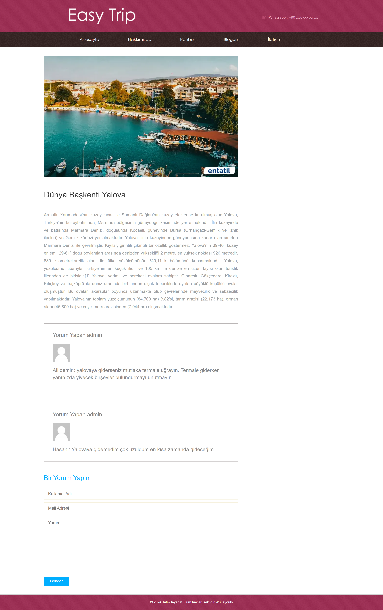
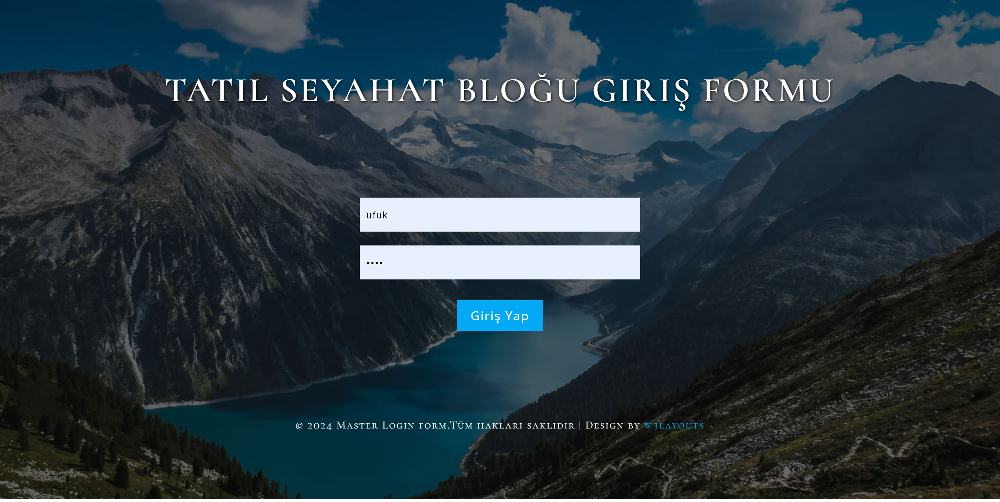
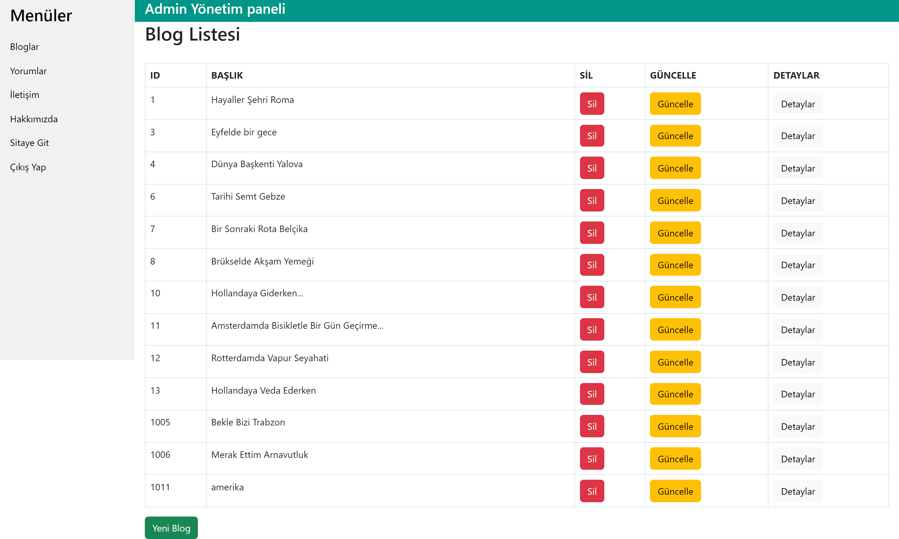
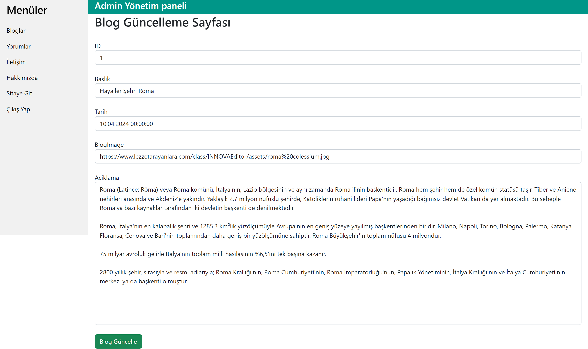
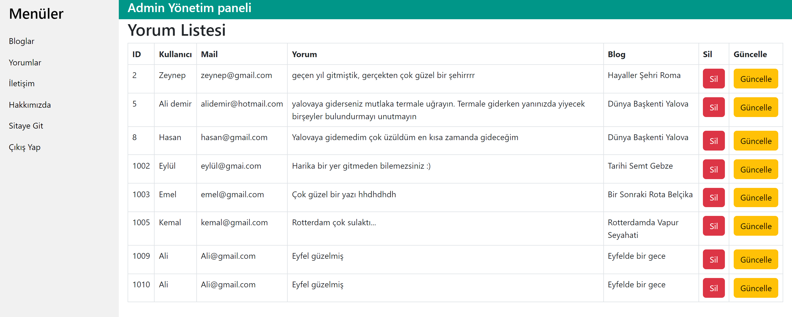

# TravelTripProje
Merhabalar, projem hakkında genel bilgiler.

Asp.Net Mvc5 ile Tatil Seyahat Sitesi projesi yapıldı.Bu projede veri tabanı için  CRUD işlemleri yapılmıştır.
Admin paneli sayesinde veri tabanı tablolarına ekleme, silme ve güncelleme işlemleri yapılabilir.

Projede Kullanılan Teknolojiler ve Kütüphaneler;
-ASP.NET Core 
-Microsoft.Entity.FrameworkCore 
-Microsoft.Entity.FrameworkCore.SqlServer 
-Layout Kontrolü
-Controller Yapısı
-View Components ile Partial View Kullanımı
-Code First
-Entity Framework
-Model Yapısı
-View Yapısı
-Linq Sorguları
-Hazır Template Kurulumu ve Düzenlenmesi
-Context Yapısı

# Anasayfa 

# Blogum Sayfası

# Blog Detay Sayfası

# Admin Giriş

# Admin Paneli

# Admin Blog Güncelleme

# Admin Yorum Listesi

